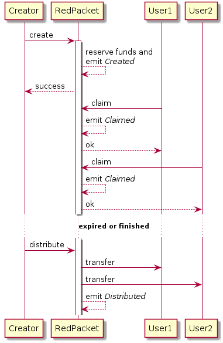

# Build a blockchain RedPacket with Substrate

### Introduction
RedPacket is an easy way to airdrop. Everyone can claim some funds from a valid RedPacket that was created by others. And creator's balance will be reserved to prevent insufficient balance error when distributing.

### Data structure and storage items

```rust
#[derive(Encode, Decode, Default, Clone, PartialEq)]
pub struct Packet<PacketId, Balance, BlockNumber, AccountId> {
    id: PacketId, // Unique id.
    total: Balance, // Total funds supplied.
    unclaimed: Balance, // Remaining balance.
    count: u32, // How many times can be claimed.
    expires_at: BlockNumber, // Expire duration
    owner: AccountId, // Creator's Accountid
    distributed: bool, // Default false, set true if distributed
}
```

```rust
decl_storage! {
    trait Store for Module<T: Trait> as RedPacket {
        /// Store all created packets
        pub Packets get(fn packets): map T::PacketId => Packet<T::PacketId, BalanceOf<T>, T::BlockNumber, T::AccountId>;
        /// Store all claim records
        pub Claims get(fn claims_of): map T::PacketId => Vec<T::AccountId>;
        /// Increase after created a Packet
        pub NextPacketId get(next_packet_id): T::PacketId;
    }
}
```

### Dispatchable functions and events

Three dispatchable functions are defined:

- `create` - Create a new RedPacket and reserve creator's funds.
- `claim` - Store a claim record for distribution.
- `distribute` - Unreserve creator's funds and do transfers.

Declare events:

```rust
decl_event!(
    pub enum Event<T> 
        where 
            AccountId = <T as system::Trait>::AccountId,
            PacketId = <T as Trait>::PacketId,
            Balance = BalanceOf<T>
    {
        /// A new RedPacket was created.
        Created(PacketId, AccountId, Balance, u32),
        /// A new claim was created.
        Claimed(PacketId, AccountId, Balance),
        /// Emit after a RedPacket is distributed
        Distributed(PacketId, AccountId, Balance),
    }
);
```

Interaction diagram:




### TODOs

- Random Redpacket - Upgrade RedPacket to support random claim.
- Auto distribution - Try to do automatic distribution in function `on_finalize` for distributable Redpackets.
- Add helper functions for `struct Packet`:
```rust
impl <PacketId, Balance, BlockNumber, AccountId> Packet<PacketId, Balance, BlockNumber, AccountId> {
    pub fn can_distribute(&self) -> bool {
        ...
    }
    pub fn is_expired(&self, block_number: BlockNumber) -> bool {
        ...
    }
    pub fn is_finished(&self) -> bool {
        ...
    }
}
```
- Building a UI for RedPacket.


# Best Practices

### Use safe arithmetic functions
There are many attacks on Ethereum Smart Contract because of the type overflow. Overflow problem is often ignored by developers, and is at high risk for attacks. It is very necessary to use safe arithmetic functions for arithmetic operations. Substrate provides [`Saturating`](https://github.com/paritytech/substrate/blob/master/primitives/arithmetic/src/traits.rs#L109) functions and [`num_traits`](https://docs.rs/num-traits/0.2.11/num_traits/) functions to do safe operations.

For example, We use `saturating_mul` in `RedPacket::create` function when calculating total reserved balances.

```rust
pub fn create(origin, quota: BalanceOf<T>, count: u32, expires: T::BlockNumber) -> DispatchResult {
    /* --snip-- */
    let total = quota.saturating_mul(<BalanceOf<T>>::from(count));
    /* --snip-- */
}
```

### Check first, then update
In Substrate module's function, updating storage operations will still be successful before the location of the error raises. That's why we must check our logic first before updating. 

Substrate provided `ensure` macro and `ensure_signed` to do checks:

1. `ensure` - The `ensure` macro expects a condition and returns an `Err` if the condition gets false, then the function exits.

2. `ensure_signed`: You should always use `ensure_signed` first in your function to check if the call is permitted, otherwise your chain might be under attack.

For example:

```rust
pub fn create(origin, quota: BalanceOf<T>, count: u32, expires: T::BlockNumber) -> DispatchResult {
    // Do checks first
    ensure!(count > 0, Error::<T>::GreaterThanZero);
    ensure!(quota > Zero::zero(), Error::<T>::GreaterThanZero);
    ensure!(expires > Zero::zero(), Error::<T>::GreaterThanZero);
    let sender = ensure_signed(origin)?;

    /* --snip-- */

    // Update finally
    <Packets<T>>::insert(id, new_packet);
    <NextPacketId<T>>::mutate(|id| *id += One::one());
    /* --snip-- */
}
```


### Use `decl_error!`

Use `decl_error!` to define errors instead of string errors. It keeps code simple and makes errors easy to manage.

Good:

```rust
decl_error! {
    /// Error
    pub enum Error for Module<T: Trait> {
        /// Sender's balance is too low.
        InsufficientBalance,
        /*--snip--*/
    }
}
```
```rust
pub fn create(origin, quota: BalanceOf<T>, count: u32, expires: T::BlockNumber) -> DispatchResult {
    /* --snip--*/
    ensure!(sender_balance >= total, Error::<T>::InsufficientBalance);
    /* --snip--*/
}
```

Bad:

```rust
pub fn create(origin, quota: BalanceOf<T>, count: u32, expires: T::BlockNumber) -> DispatchResult {
    /* --snip--*/
    ensure!(sender_balance >= total, "Insufficient balance");
    /* --snip--*/
}
```

### Write more tests
Testing is very important, especially in blockchain project. Writing test code guarantees code quality and makes your code easy to read.

